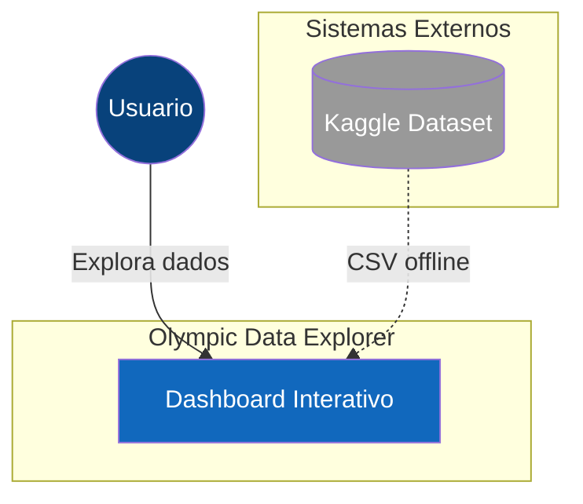
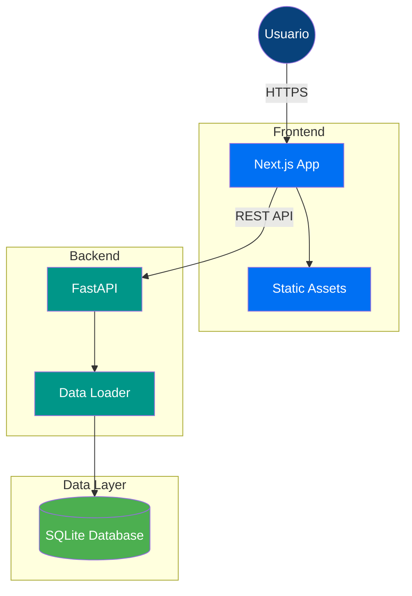
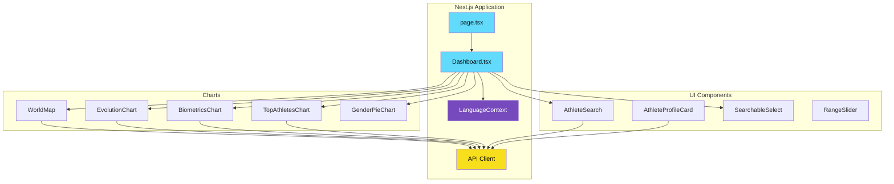
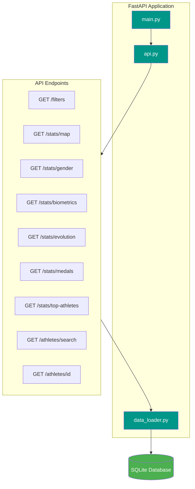
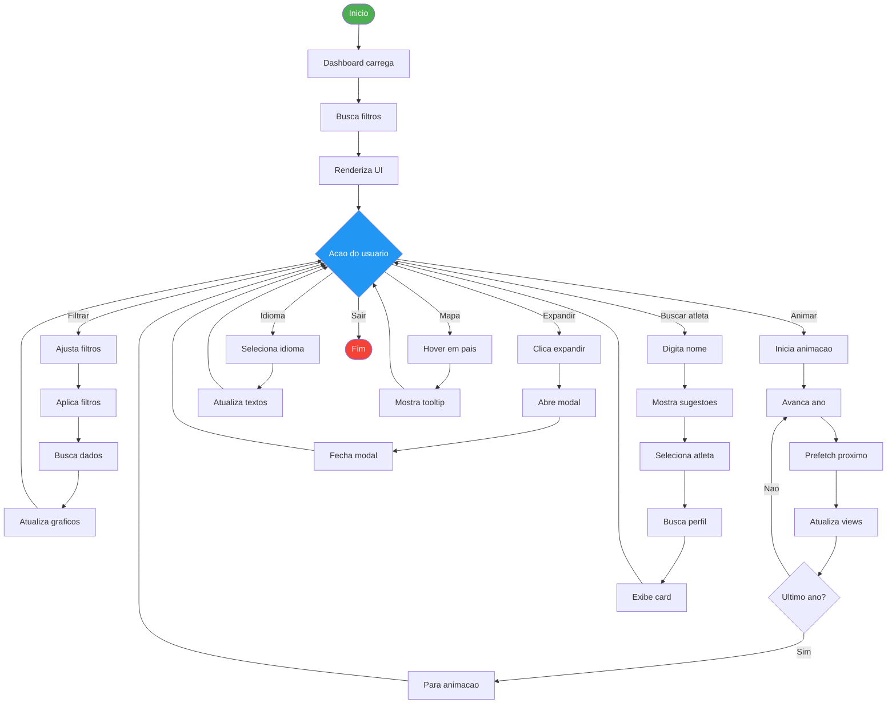

<p align="center">
  
</p>

<h1 align="center">🏅 Olympic Data Explorer</h1>

<p align="center">
  <strong>Dashboard Interativo para Exploração de 120 Anos de História Olímpica</strong>
</p>

<p align="center">
  
  
  
  
  
  
</p>

<p align="center">
  
  
  
  
</p>

---

## 📋 Índice

- [Sobre o Projeto](#-sobre-o-projeto)
- [Dataset](#-dataset)
- [Funcionalidades](#-funcionalidades)
- [Estatísticas do Projeto](#-estatísticas-do-projeto)
- [Tecnologias](#-tecnologias)
- [Arquitetura](#-arquitetura)
- [Como Rodar](#-como-rodar)
- [Testes Automatizados](#-testes-automatizados)
- [API Endpoints](#-api-endpoints)
- [Estrutura do Projeto](#-estrutura-do-projeto)
- [Documentação](#-documentação)
- [Contribuição](#-contribuição)

---

## 🎯 Sobre o Projeto

O **Olympic Data Explorer** é uma aplicação web completa para visualização e análise de dados históricos dos Jogos Olímpicos, abrangendo **120 anos de história** (1896-2016). O projeto combina um backend robusto em Python com um frontend moderno e responsivo, oferecendo múltiplas visualizações interativas para explorar padrões, tendências e curiosidades do mundo olímpico.

### 🎓 Contexto Acadêmico

Este projeto foi desenvolvido como parte da disciplina de **Visualização de Dados** do curso de graduação, aplicando conceitos de:
- Design de dashboards interativos
- Visualização de dados multidimensionais
- Processamento e análise de grandes conjuntos de dados
- Desenvolvimento full-stack moderno

---

## 📊 Dataset

Este projeto utiliza o dataset público do Kaggle:

### [120 Years of Olympic History: Athletes and Results](https://www.kaggle.com/datasets/heesoo37/120-years-of-olympic-history-athletes-and-results?resource=download)

| Atributo | Descrição |
|----------|-----------|
| **Período** | 1896 - 2016 |
| **Registros** | 271.116 entradas |
| **Atletas** | ~135.000 atletas únicos |
| **Países** | 230 NOCs (Comitês Olímpicos Nacionais) |
| **Esportes** | 66 modalidades |
| **Eventos** | 765 eventos distintos |

#### Colunas do Dataset

| Coluna | Tipo | Descrição |
|--------|------|-----------|
| `ID` | int | Identificador único do atleta |
| `Name` | str | Nome completo do atleta |
| `Sex` | str | Gênero (M/F) |
| `Age` | int | Idade durante a competição |
| `Height` | float | Altura em centímetros |
| `Weight` | float | Peso em quilogramas |
| `Team` | str | Nome da equipe/país |
| `NOC` | str | Código do Comitê Olímpico Nacional (3 letras) |
| `Games` | str | Ano e temporada (ex: "2016 Summer") |
| `Year` | int | Ano da edição olímpica |
| `Season` | str | Temporada (Summer/Winter) |
| `City` | str | Cidade sede |
| `Sport` | str | Modalidade esportiva |
| `Event` | str | Evento específico |
| `Medal` | str | Medalha conquistada (Gold/Silver/Bronze/NA) |

---

## ✨ Funcionalidades

### 🗺️ Mapa Global Interativo
- Visualização geográfica da distribuição de medalhas por país
- Escala de cores dinâmica baseada no total de medalhas
- Tooltips detalhados com breakdown Gold/Silver/Bronze
- Zoom e pan para navegação
- Animação temporal com player automático

### 📈 Evolução Histórica
- Gráfico de linha mostrando a evolução dos Top 10 países
- Legenda interativa para filtrar países
- Notas históricas sobre mudanças geopolíticas (USSR → RUS, etc.)
- Suporte a múltiplas séries temporais

### 🏋️ Análise Biométrica
- Scatter plot de Altura vs Peso dos atletas
- Agrupamento por modalidade esportiva
- Diferenciação visual por tipo de medalha
- Clustering para visualização de múltiplos pontos
- Tooltips com detalhes do atleta

### 🏆 Ranking de Atletas
- Top 10 atletas mais medalhistas
- Filtros por tipo de medalha (Ouro/Prata/Bronze)
- Gráfico de barras horizontais interativo
- Links para perfil detalhado do atleta

### 📊 Distribuição por Gênero
- Gráfico de pizza interativo (donut chart)
- Visualização da proporção de atletas masculinos/femininos
- Cores olímpicas (azul para masculino, vermelho para feminino)
- Tooltips detalhados com contagem e percentual

### 👤 Perfil do Atleta
- Busca por nome com autocomplete
- Card detalhado com foto, biometria e estatísticas
- Histórico completo de participações
- Evolução de medalhas por edição
- Medalhas por modalidade

### 🎛️ Filtros Globais
- **Temporada:** Verão, Inverno ou Ambos
- **Gênero:** Masculino, Feminino ou Todos
- **País:** Seletor com busca por nome
- **Modalidade:** Seletor com todas as modalidades
- **Ano:** Slider com player animado
- **Velocidade:** Controle de velocidade da animação

### 🌐 Internacionalização (i18n)
- Português (Brasil) 🇧🇷
- English 🇺🇸
- Español 🇪🇸
- Français 🇫🇷
- 中文 🇨🇳

### 📱 Interface Responsiva
- Design adaptativo para desktop, tablet e mobile
- Sidebar colapsável em telas menores
- Modais de expansão para visualização detalhada

---

## 📊 Estatísticas do Projeto

| Métrica | Valor |
|---------|-------|
| **Linhas de Código (Backend)** | ~2.200 |
| **Linhas de Código (Frontend)** | ~8.600 |
| **Total de Arquivos** | 50+ |
| **Cobertura de Testes (Backend)** | 99% |
| **Cobertura de Testes (Frontend)** | 98.81% |
| **Total de Testes** | 489 |
| **Endpoints da API** | 12 |
| **Componentes React** | 16+ |
| **Idiomas Suportados** | 5 |

---

## 🛠️ Tecnologias

### Backend

| Tecnologia | Versão | Uso |
|------------|--------|-----|
| **Python** | 3.10+ | Linguagem principal |
| **FastAPI** | 0.109+ | Framework web assíncrono |
| **Uvicorn** | 0.27+ | Servidor ASGI |
| **Pandas** | 2.2+ | Processamento de dados |
| **NumPy** | 1.26+ | Computação numérica |
| **Pytest** | 8.0+ | Framework de testes |
| **pytest-cov** | 4.1+ | Cobertura de testes |
| **HTTPX** | 0.27+ | Cliente HTTP para testes |

### Frontend

| Tecnologia | Versão | Uso |
|------------|--------|-----|
| **Next.js** | 15.1.9 | Framework React |
| **React** | 19.0.0 | Biblioteca UI |
| **TypeScript** | 5 | Tipagem estática |
| **Tailwind CSS** | 4 | Estilização |
| **Recharts** | 3.4.1 | Gráficos |
| **React Simple Maps** | 3.0 | Mapas geográficos |
| **D3.js** | 3.1 (d3-geo) | Projeções geográficas |
| **Framer Motion** | 12.23.24 | Animações |
| **Lucide React** | 0.554 | Ícones |
| **Jest** | 30.2.0 | Framework de testes |
| **Testing Library** | 16.3 | Testes de componentes |

---

## 🏗️ Arquitetura

### Big Picture (Visão Geral)

```mermaid
graph TB
    subgraph clients["Client Layer"]
        Browser["Browser"]
        Mobile["Mobile"]
    end
    
    subgraph frontend["Frontend - Next.js"]
        NextApp["Next.js App Router"]
        Components["React Components"]
        Charts["Recharts / D3.js"]
        Maps["React Simple Maps"]
        Context["Language Context"]
        APIClient["API Client"]
    end
    
    subgraph backend["Backend - FastAPI"]
        FastAPI["FastAPI Server"]
        Router["API Router"]
        DataLoader["Data Loader"]
        Filters["Filter Engine"]
    end
    
    subgraph datalayer["Data Layer"]
        SQLite[("olympics.db")]
    end
    
    Browser --> NextApp
    Mobile --> NextApp
    NextApp --> Components
    Components --> Charts
    Components --> Maps
    Components --> Context
    Components --> APIClient
    APIClient -->|"HTTP/REST"| FastAPI
    FastAPI --> Router
    Router --> Filters
    Filters --> DataLoader
    DataLoader --> SQLite
    
    style Browser fill:#e1f5fe
    style Mobile fill:#e1f5fe
    style NextApp fill:#0070f3,color:#fff
    style FastAPI fill:#009688,color:#fff
    style SQLite fill:#4caf50,color:#fff
```



### Diagrama C4 - Contexto



### Diagrama C4 - Container



### Diagrama C4 - Componentes (Frontend)



### Diagrama C4 - Componentes (Backend)



### Fluxograma de Uso



---

## 🚀 Como Rodar

### Pré-requisitos

| Requisito | Versão Mínima |
|-----------|---------------|
| **Python** | 3.10+ |
| **Node.js** | 18+ |
| **npm** | 9+ |
| **Git** | 2.0+ |

### 📥 1. Clone o Repositório

```bash
git clone https://github.com/italomanzine/olympic-data-explorer.git
cd olympic-data-explorer
```

### 📦 2. Download do Dataset

Baixe o dataset do Kaggle e coloque em `backend/data/`:

1. Acesse: https://www.kaggle.com/datasets/heesoo37/120-years-of-olympic-history-athletes-and-results
2. Baixe `athlete_events.csv`
3. Coloque em `backend/data/athlete_events.csv`

> **Nota:** Após baixar o CSV, execute `python scripts/convert_to_sqlite.py` na pasta backend para gerar o banco SQLite `olympics.db`.

---

### 🐧 Linux / 🍎 macOS

#### Backend

```bash
# Navegue para o diretório do backend
cd backend

# Crie o ambiente virtual
python3 -m venv venv

# Ative o ambiente virtual
source venv/bin/activate

# Instale as dependências
pip install -r requirements.txt

# Inicie o servidor
uvicorn app.main:app --reload
```

#### Frontend (em outro terminal)

```bash
# Navegue para o diretório do frontend
cd frontend

# Instale as dependências
npm install

# Inicie o servidor de desenvolvimento
npm run dev
```

---

### 🪟 Windows

#### Backend (PowerShell)

```powershell
# Navegue para o diretório do backend
cd backend

# Crie o ambiente virtual
python -m venv venv

# Ative o ambiente virtual
.\venv\Scripts\Activate.ps1

# Instale as dependências
pip install -r requirements.txt

# Inicie o servidor
uvicorn app.main:app --reload
```

#### Backend (CMD)

```cmd
cd backend
python -m venv venv
venv\Scripts\activate.bat
pip install -r requirements.txt
uvicorn app.main:app --reload
```

#### Frontend (em outro terminal)

```powershell
cd frontend
npm install
npm run dev
```

---

### 🌐 Acessando a Aplicação

| Serviço | URL |
|---------|-----|
| **Dashboard** | http://localhost:3000 |
| **API** | http://localhost:8000 |
| **API Docs (Swagger)** | http://localhost:8000/docs |
| **API Docs (ReDoc)** | http://localhost:8000/redoc |

---

## 🧪 Testes Automatizados

O projeto possui uma suíte completa de testes automatizados com alta cobertura de código.

### 📊 Cobertura Atual

#### Backend (Python)

| Arquivo | Statements | Coverage |
|---------|------------|----------|
| `app/__init__.py` | 0 | 100% |
| `app/api.py` | 346 | 99% |
| `app/data_loader.py` | 81 | 100% |
| `app/main.py` | 12 | 100% |
| **Total** | **439** | **99%** ✅ |

**Total de testes backend: 162**

#### Frontend (TypeScript/React)

| Categoria | Statements | Branches | Functions | Lines |
|-----------|------------|----------|-----------|-------|
| `app/` | 100% | 100% | 100% | 100% |
| `components/` | 97.11% | 81.32% | 53.84% | 97.11% |
| `components/charts/` | 99.34% | 90.24% | 94.11% | 99.34% |
| `components/ui/` | 100% | 99.05% | 96.77% | 100% |
| `contexts/` | 100% | 100% | 100% | 100% |
| `lib/` | 98.93% | 100% | 93.75% | 98.93% |
| **Total** | **98.81%** | **89%** | **80.9%** | **98.81%** ✅ |

**Total de testes frontend: 327**

---

### ▶️ Executando os Testes

#### Backend

```bash
cd backend

# Ativar ambiente virtual
source venv/bin/activate  # Linux/macOS
# ou
.\venv\Scripts\Activate.ps1  # Windows

# Rodar testes
pytest

# Rodar testes com cobertura
pytest --cov=app --cov-report=html

# Rodar testes verboso
pytest -v

# Rodar teste específico
pytest tests/test_api.py -v
```

#### Frontend

```bash
cd frontend

# Rodar testes
npm test

# Rodar testes com cobertura
npm run test:coverage

# Rodar testes em modo watch
npm run test:watch

# Rodar teste específico
npm test -- --testPathPattern="Dashboard"
```

---

### 📁 Estrutura de Testes

```
backend/tests/
├── conftest.py           # Fixtures compartilhadas
├── test_api.py           # Testes dos endpoints
├── test_data_loader.py   # Testes do carregamento de dados
├── test_edge_cases.py    # Casos de borda
├── test_final_coverage.py # Testes para 100% coverage
└── test_main.py          # Testes do entrypoint

frontend/src/__tests__/
├── app/
│   └── page.test.tsx
├── components/
│   ├── AthleteProfileCard.test.tsx
│   ├── Dashboard.test.tsx
│   ├── MedalTable.test.tsx
│   └── charts/
│       ├── BiometricsChart.test.tsx
│       ├── EvolutionChart.test.tsx
│       ├── GenderPieChart.test.tsx
│       ├── TopAthletesChart.test.tsx
│       ├── WorldMap.test.tsx
│       └── tooltips.test.tsx
│   └── ui/
│       ├── AthleteSearch.test.tsx
│       ├── ChartModal.test.tsx
│       ├── ChartSkeleton.test.tsx
│       ├── CountryFlag.test.tsx
│       ├── LanguageSelector.test.tsx
│       ├── RangeSlider.test.tsx
│       └── SearchableSelect.test.tsx
├── contexts/
│   └── LanguageContext.test.tsx
└── lib/
    ├── api.test.ts
    ├── flags.test.ts
    └── translations.test.ts
```

---

## 🔌 API Endpoints

| Método | Endpoint | Descrição |
|--------|----------|-----------|
| `GET` | `/` | Health check básico |
| `GET` | `/health` | Status da API |
| `GET` | `/api/filters` | Opções de filtros (anos, esportes, países) |
| `GET` | `/api/stats/map` | Dados para mapa de medalhas |
| `GET` | `/api/stats/gender` | Distribuição de atletas por gênero |
| `GET` | `/api/stats/biometrics` | Dados de altura/peso dos atletas |
| `GET` | `/api/stats/evolution` | Evolução temporal de medalhas |
| `GET` | `/api/stats/medals` | Quadro de medalhas |
| `GET` | `/api/stats/top-athletes` | Top atletas medalhistas |
| `GET` | `/api/athletes/search` | Busca atletas por nome |
| `GET` | `/api/athletes/{id}` | Perfil completo do atleta |
| `GET` | `/api/athletes/{id}/stats` | Estatísticas do atleta |

### Parâmetros Comuns

| Parâmetro | Tipo | Descrição |
|-----------|------|-----------|
| `year` | int | Ano específico (1896-2016) |
| `start_year` | int | Ano inicial do intervalo |
| `end_year` | int | Ano final do intervalo |
| `season` | str | "Summer", "Winter" ou "Both" |
| `sex` | str | "M", "F" ou "Both" |
| `country` | str | Código NOC (ex: "BRA", "USA") |
| `sport` | str | Nome do esporte (ex: "Swimming") |

---

## 📁 Estrutura do Projeto

```
olympic-data-explorer/
├── 📄 README.md              # Este arquivo
├── 📄 ARCHITECTURE.md        # Documentação de arquitetura
├── 📄 SPEC.md               # Especificação do produto
├── 📄 .gitignore            # Arquivos ignorados pelo Git
│
├── 📁 backend/              # API Python/FastAPI
│   ├── 📁 app/
│   │   ├── 📄 __init__.py
│   │   ├── 📄 main.py       # Entrypoint FastAPI
│   │   ├── 📄 api.py        # Rotas da API
│   │   └── 📄 data_loader.py # Carregamento de dados
│   ├── 📁 data/
│   │   ├── 📄 athlete_events.csv  # Dataset original
│   │   └── 📄 olympics.db         # Banco SQLite (gerado)
│   ├── 📁 tests/            # Testes do backend
│   └── 📄 requirements.txt  # Dependências Python
│
└── 📁 frontend/             # Dashboard Next.js/React
    ├── 📁 src/
    │   ├── 📁 app/          # Pages (App Router)
    │   ├── 📁 components/   # Componentes React
    │   │   ├── 📁 charts/   # Gráficos
    │   │   └── 📁 ui/       # Componentes de UI
    │   ├── 📁 contexts/     # React Contexts
    │   ├── 📁 lib/          # Utilitários e API client
    │   │   └── 📁 i18n/     # Traduções
    │   ├── 📁 types/        # TypeScript types
    │   └── 📁 __tests__/    # Testes do frontend
    ├── 📄 package.json      # Dependências Node.js
    ├── 📄 jest.config.ts    # Configuração Jest
    ├── 📄 tailwind.config.ts # Configuração Tailwind
    └── 📄 tsconfig.json     # Configuração TypeScript
```

---

## 📚 Documentação

A documentação completa do projeto segue as melhores práticas de **Spec Driven Development (SDD)** e está organizada na pasta `/docs/`:

| Documento | Descrição |
|-----------|-----------|
| [📋 SPEC.md](docs/SPEC.md) | Especificação de requisitos funcionais e não-funcionais |
| [🏗️ ARCHITECTURE.md](docs/ARCHITECTURE.md) | Arquitetura do sistema com diagramas e decisões |
| [📝 CHANGELOG.md](docs/CHANGELOG.md) | Histórico de versões seguindo Keep a Changelog |

### Architecture Decision Records (ADRs)

| ADR | Decisão |
|-----|---------|
| [ADR-001](docs/ADR/ADR-001-fastapi.md) | Escolha do FastAPI como framework backend |
| [ADR-002](docs/ADR/ADR-002-nextjs.md) | Escolha do Next.js como framework frontend |
| [ADR-003](docs/ADR/ADR-003-pandas-in-memory.md) | Processamento in-memory com Pandas |
| [ADR-004](docs/ADR/ADR-004-testing-strategy.md) | Estratégia de testes com alta cobertura |

---

## 🤝 Contribuição

Contribuições são bem-vindas! Por favor, siga estes passos:

1. **Fork** o projeto
2. Crie uma **branch** para sua feature (`git checkout -b feature/NovaFeature`)
3. **Commit** suas mudanças (`git commit -m 'Add: nova feature'`)
4. **Push** para a branch (`git push origin feature/NovaFeature`)
5. Abra um **Pull Request**

### Padrões de Commit

- `Add:` Nova funcionalidade
- `Fix:` Correção de bug
- `Docs:` Documentação
- `Style:` Formatação
- `Refactor:` Refatoração
- `Test:` Testes
- `Chore:` Manutenção

---

## 📄 Licença

Este projeto está sob a licença MIT. Veja o arquivo [LICENSE](LICENSE) para mais detalhes.

---

## 👨‍💻 Autor

**Ítalo Manzine**

- GitHub: [@italomanzine](https://github.com/italomanzine)

---

<p align="center">
  Feito com ❤️ e ☕ para a disciplina de Visualização de Dados
</p>

<p align="center">
  
</p>

