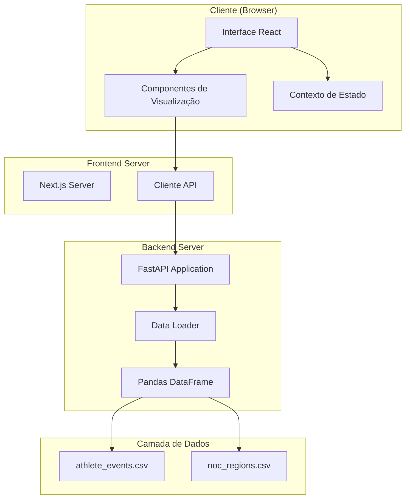
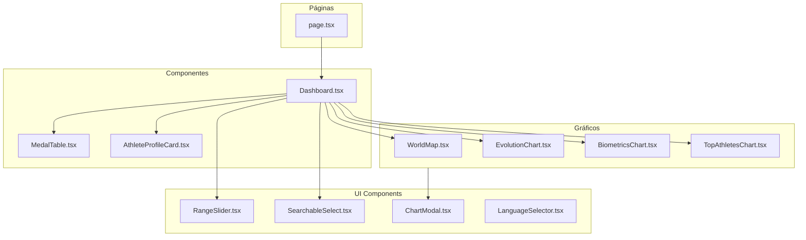
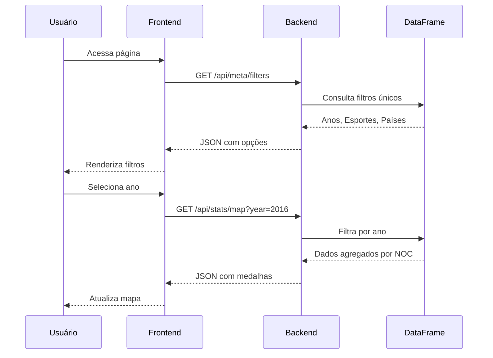
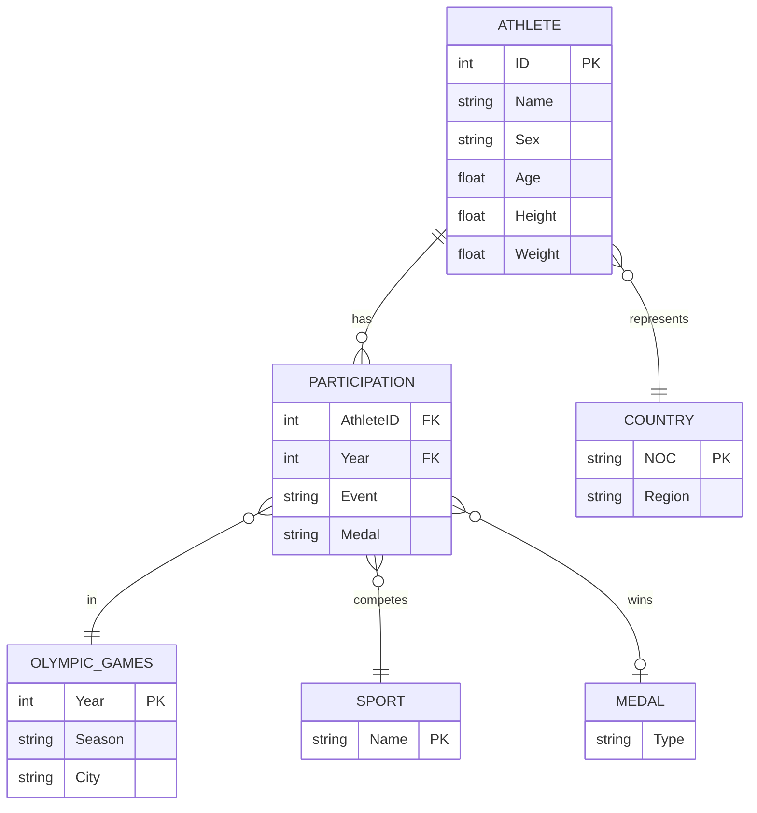
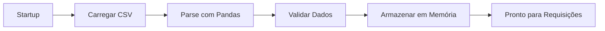
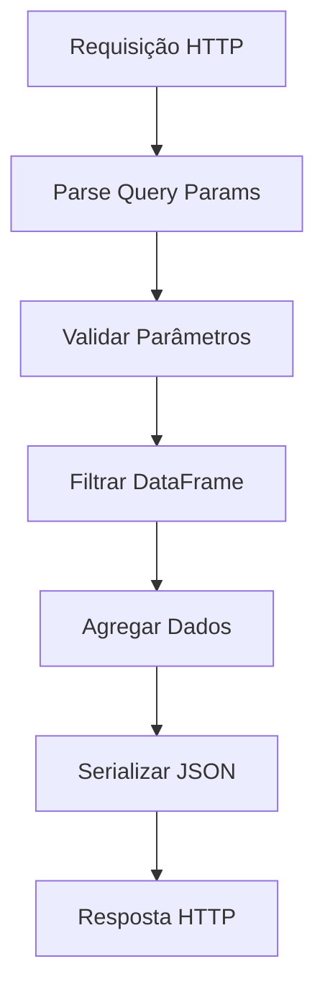
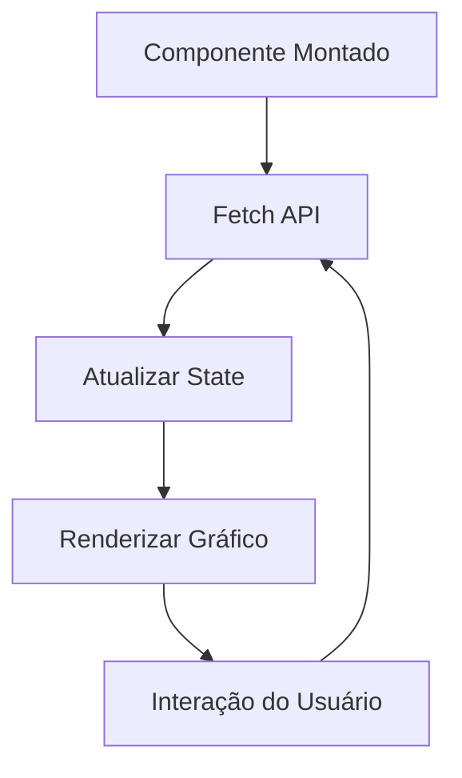
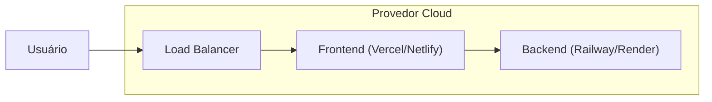

# Arquitetura do Sistema - Olympic Data Visualization

> **Versão:** 1.0.0  
> **Última atualização:** 2025-01-20  
> **Autor:** Ítalo Manzine

---

## Índice

1. [Visão Geral da Arquitetura](#1-visão-geral-da-arquitetura)
2. [Stack Tecnológica](#2-stack-tecnológica)
3. [Diagrama de Arquitetura](#3-diagrama-de-arquitetura)
4. [Estrutura de Diretórios](#4-estrutura-de-diretórios)
5. [Modelo de Dados](#5-modelo-de-dados)
6. [API Design](#6-api-design)
7. [Fluxo de Dados](#7-fluxo-de-dados)
8. [Decisões Arquiteturais](#8-decisões-arquiteturais)
9. [Considerações de Segurança](#9-considerações-de-segurança)
10. [Estratégia de Deploy](#10-estratégia-de-deploy)
11. [Observabilidade](#11-observabilidade)
12. [Limitações e Trade-offs](#12-limitações-e-trade-offs)

---

## 1. Visão Geral da Arquitetura

O sistema segue uma **arquitetura de duas camadas** (Two-Tier Architecture) com separação clara entre frontend e backend:

```
┌─────────────────┐         ┌─────────────────┐
│                 │  REST   │                 │
│   Frontend      │◄───────►│   Backend       │
│   (Next.js)     │   API   │   (FastAPI)     │
│                 │         │                 │
└─────────────────┘         └────────┬────────┘
                                     │
                                     ▼
                            ┌─────────────────┐
                            │   Dataset CSV   │
                            │   (In-Memory)   │
                            └─────────────────┘
```

### Características Principais

- **Stateless Backend**: Todas as requisições são independentes
- **In-Memory Data**: Dataset carregado na inicialização para performance
- **Client-Side Rendering**: Visualizações renderizadas no navegador
- **Internacionalização**: Suporte a 5 idiomas (pt-BR, en, es, fr, zh)

---

## 2. Stack Tecnológica

### 2.1 Frontend

| Tecnologia | Versão | Propósito |
|------------|--------|-----------|
| Next.js | 16.0.3 | Framework React com SSR/SSG |
| React | 19.2.0 | Biblioteca de UI |
| TypeScript | 5.x | Tipagem estática |
| Tailwind CSS | 4.x | Estilização utilitária |
| Recharts | 2.15.2 | Gráficos (área, linha, scatter, bar) |
| React Simple Maps | 3.0.0 | Mapa coroplético |
| Framer Motion | 12.x | Animações |

**ADR Relacionado:** [ADR-002: Escolha do Next.js](ADR/ADR-002-nextjs.md)

### 2.2 Backend

| Tecnologia | Versão | Propósito |
|------------|--------|-----------|
| FastAPI | 0.109+ | Framework web assíncrono |
| Python | 3.10+ | Linguagem de programação |
| Pandas | 2.2+ | Processamento de dados |
| Uvicorn | 0.27+ | Servidor ASGI |

**ADR Relacionado:** [ADR-001: Escolha do FastAPI](ADR/ADR-001-fastapi.md)

### 2.3 Testes

| Tecnologia | Versão | Propósito |
|------------|--------|-----------|
| pytest | 8.x | Testes backend |
| pytest-cov | 4.x | Cobertura backend |
| Jest | 30.2.0 | Testes frontend |
| Testing Library | 16.3.0 | Testes de componentes React |

**ADR Relacionado:** [ADR-004: Estratégia de Testes](ADR/ADR-004-testing-strategy.md)

---

## 3. Diagrama de Arquitetura

### 3.1 Arquitetura de Alto Nível



### 3.2 Diagrama de Componentes Frontend



### 3.3 Diagrama de Sequência - Carregamento de Dados



---

## 4. Estrutura de Diretórios

```
/
├── backend/
│   ├── app/
│   │   ├── __init__.py
│   │   ├── main.py           # Entrypoint FastAPI
│   │   ├── api.py            # Definição de rotas
│   │   └── data_loader.py    # Carregamento e processamento
│   ├── data/
│   │   ├── athlete_events.csv   # Dataset principal (271K registros)
│   │   └── noc_regions.csv      # Mapeamento NOC → País
│   ├── tests/
│   │   └── test_main.py      # 107 testes unitários
│   └── requirements.txt
│
├── frontend/
│   ├── src/
│   │   ├── app/              # App Router (Next.js 13+)
│   │   │   ├── layout.tsx    # Layout raiz
│   │   │   ├── page.tsx      # Página principal
│   │   │   └── globals.css   # Estilos globais
│   │   ├── components/
│   │   │   ├── Dashboard.tsx         # Orquestrador principal
│   │   │   ├── MedalTable.tsx        # Tabela de medalhas
│   │   │   ├── AthleteProfileCard.tsx # Card de atleta
│   │   │   ├── charts/               # Componentes de visualização
│   │   │   │   ├── WorldMap.tsx
│   │   │   │   ├── EvolutionChart.tsx
│   │   │   │   ├── BiometricsChart.tsx
│   │   │   │   └── TopAthletesChart.tsx
│   │   │   └── ui/                   # Componentes de UI
│   │   │       ├── RangeSlider.tsx
│   │   │       ├── SearchableSelect.tsx
│   │   │       ├── ChartModal.tsx
│   │   │       └── LanguageSelector.tsx
│   │   ├── contexts/
│   │   │   └── LanguageContext.tsx   # Internacionalização
│   │   ├── lib/
│   │   │   ├── api.ts                # Cliente HTTP
│   │   │   ├── flags.ts              # Emoji de bandeiras
│   │   │   └── i18n/translations.ts  # Traduções
│   │   └── types/
│   │       └── react-simple-maps.d.ts
│   └── package.json
│
├── docs/                     # Documentação do projeto
│   ├── SPEC.md               # Especificação de requisitos
│   ├── ARCHITECTURE.md       # Este documento
│   ├── CHANGELOG.md          # Histórico de versões
│   └── ADR/                  # Architecture Decision Records
│       ├── ADR-001-fastapi.md
│       ├── ADR-002-nextjs.md
│       ├── ADR-003-pandas-in-memory.md
│       └── ADR-004-testing-strategy.md
│
└── README.md                 # Documentação principal
```

---

## 5. Modelo de Dados

### 5.1 Dataset Principal (athlete_events.csv)

| Coluna | Tipo | Descrição | Exemplo |
|--------|------|-----------|---------|
| ID | int | Identificador único do atleta | 1 |
| Name | string | Nome completo | "Michael Fred Phelps II" |
| Sex | string | Sexo (M/F) | "M" |
| Age | float | Idade (pode ser NaN) | 23 |
| Height | float | Altura em cm (pode ser NaN) | 193 |
| Weight | float | Peso em kg (pode ser NaN) | 90 |
| Team | string | Nome do time/país | "United States" |
| NOC | string | Código ISO do país | "USA" |
| Games | string | Ano + Temporada | "2016 Summer" |
| Year | int | Ano da olimpíada | 2016 |
| Season | string | Summer/Winter | "Summer" |
| City | string | Cidade sede | "Rio de Janeiro" |
| Sport | string | Esporte | "Swimming" |
| Event | string | Evento específico | "Men's 200 metres" |
| Medal | string | Gold/Silver/Bronze/NaN | "Gold" |

### 5.2 Mapeamento de Regiões (noc_regions.csv)

| Coluna | Tipo | Descrição |
|--------|------|-----------|
| NOC | string | Código ISO |
| region | string | Nome do país |
| notes | string | Observações |

### 5.3 Diagrama Entidade-Relacionamento



---

## 6. API Design

### 6.1 Endpoints

| Método | Endpoint | Descrição | Parâmetros |
|--------|----------|-----------|------------|
| GET | `/api/meta/filters` | Retorna opções de filtros | - |
| GET | `/api/stats/map` | Dados do mapa coroplético | `year`, `season`, `sport` |
| GET | `/api/stats/biometrics` | Dados biométricos | `year`, `season`, `sport` |
| GET | `/api/stats/evolution` | Série temporal | `noc`, `season` |
| GET | `/api/stats/top-athletes` | Top atletas | `year`, `season`, `sport`, `noc` |
| GET | `/api/athlete/{id}` | Perfil do atleta | - |
| GET | `/api/search/athletes` | Busca atletas | `query` |
| GET | `/health` | Health check | - |

### 6.2 Formato de Resposta

Todas as respostas seguem o padrão JSON:

```json
{
  "data": [...],
  "meta": {
    "count": 100,
    "filters_applied": {
      "year": 2016,
      "season": "Summer"
    }
  }
}
```

### 6.3 Tratamento de Erros

| Código | Descrição | Exemplo |
|--------|-----------|---------|
| 400 | Bad Request | Parâmetro inválido |
| 404 | Not Found | Atleta não encontrado |
| 500 | Internal Error | Erro no processamento |

---

## 7. Fluxo de Dados

### 7.1 Inicialização do Backend



### 7.2 Processamento de Requisição



### 7.3 Renderização Frontend



---

## 8. Decisões Arquiteturais

As principais decisões estão documentadas em Architecture Decision Records (ADRs):

| ADR | Título | Status |
|-----|--------|--------|
| [ADR-001](ADR/ADR-001-fastapi.md) | Escolha do FastAPI como framework backend | Aceito |
| [ADR-002](ADR/ADR-002-nextjs.md) | Escolha do Next.js como framework frontend | Aceito |
| [ADR-003](ADR/ADR-003-pandas-in-memory.md) | Processamento in-memory com Pandas | Aceito |
| [ADR-004](ADR/ADR-004-testing-strategy.md) | Estratégia de testes com alta cobertura | Aceito |

### Resumo das Decisões

1. **FastAPI sobre Flask/Django**: Performance, tipagem nativa, documentação automática
2. **Next.js sobre React puro**: SSR opcional, roteamento integrado, otimizações automáticas
3. **Pandas in-memory sobre banco de dados**: Simplicidade, performance para dataset estático
4. **Jest + Testing Library**: Ecossistema maduro, suporte a React 19

---

## 9. Considerações de Segurança

### 9.1 CORS

```python
app.add_middleware(
    CORSMiddleware,
    allow_origins=["http://localhost:3000"],
    allow_methods=["GET"],
    allow_headers=["*"],
)
```

### 9.2 Input Validation

- Todos os parâmetros são validados com Pydantic
- Query parameters são tipados e documentados
- Valores inválidos retornam 400 Bad Request

### 9.3 Limitações de Produção

> ⚠️ **Atenção**: Este é um projeto acadêmico e não inclui:
> - Autenticação/Autorização
> - Rate limiting
> - HTTPS em desenvolvimento
> - Logs de auditoria

---

## 10. Estratégia de Deploy

### 10.1 Desenvolvimento Local

```bash
# Backend (Terminal 1)
cd backend && python -m uvicorn app.main:app --reload

# Frontend (Terminal 2)
cd frontend && npm run dev
```

### 10.2 Produção (Sugestão)



### 10.3 Docker (Opcional)

```yaml
# docker-compose.yml (sugerido)
version: '3.8'
services:
  backend:
    build: ./backend
    ports:
      - "8000:8000"
  
  frontend:
    build: ./frontend
    ports:
      - "3000:3000"
    depends_on:
      - backend
```

---

## 11. Observabilidade

### 11.1 Logging

- Backend: Logs estruturados via `logging` do Python
- Frontend: Console logs em desenvolvimento

### 11.2 Métricas (Sugerido para produção)

- Tempo de resposta por endpoint
- Taxa de erros
- Uso de memória do DataFrame

### 11.3 Health Check

```bash
curl http://localhost:8000/health
# {"status": "healthy"}
```

---

## 12. Limitações e Trade-offs

### 12.1 Limitações Atuais

| Limitação | Impacto | Mitigação |
|-----------|---------|-----------|
| Dataset em memória | ~50MB RAM | Aceitável para escala atual |
| Sem cache | Reprocessamento a cada request | Dados pequenos, tempo < 100ms |
| Single thread | Não escala horizontalmente | Adequado para uso acadêmico |

### 12.2 Trade-offs

| Decisão | Prós | Contras |
|---------|------|---------|
| CSV sobre DB | Simples, portável | Sem queries complexas |
| Client-side charts | Interatividade | Peso no browser |
| Monorepo | Facilidade de manutenção | Builds acoplados |

### 12.3 Melhorias Futuras

1. **Cache com Redis**: Reduzir processamento repetido
2. **Banco de dados**: PostgreSQL para queries complexas
3. **SSR para SEO**: Renderização server-side de gráficos
4. **API GraphQL**: Flexibilidade nas queries

---

## Referências

- [FastAPI Documentation](https://fastapi.tiangolo.com/)
- [Next.js Documentation](https://nextjs.org/docs)
- [Recharts API](https://recharts.org/en-US/api)
- [React Simple Maps](https://www.react-simple-maps.io/)
- [Pandas Documentation](https://pandas.pydata.org/docs/)
